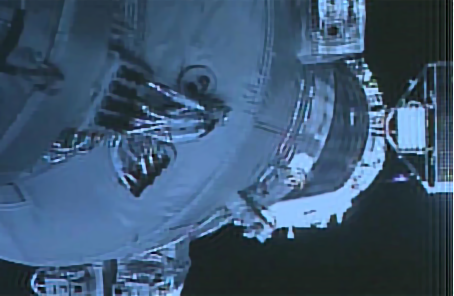
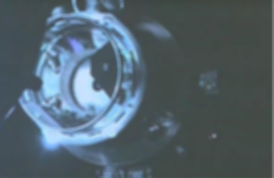
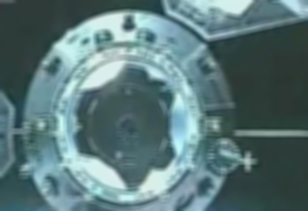

# Enhanced Space-Variant Deblurring of Spacecraft Images via Detail-Preserving Techniques

During spacecraft launch, flight, and docking, ground-based and space-based imaging systems play
a crucial role in monitoring spacecraft pose and flight status. However, images captured by these
systems often suffer from space-variant blurring caused by atmospheric turbulence, defocus, and
relative motion. To address this challenge, we propose a novel deblurring method tailored for space
variant degraded spacecraft images. Our approach begins by identifying and extracting detail feature
regions using multiscale morphological gradients and adaptive thresholds, allowing for a preliminary
estimation of the blur kernel. We then construct an initial space-variant blur kernel through linear
interpolation and refine it by introducing a space-variant blur kernel error term to mitigate inaccura
cies. Additionally, shearlet wavelet regularization is incorporated to enhance local detail restoration.
A multivariable minimization alternating iteration strategy is employed to solve the degradation
model and achieve image deblurring. Experimental results demonstrate that our method outperforms
advanced deblurring techniques in preserving intricate details of space-variant degraded spacecraft
images.


##  Update Log
v1.0.0 (2025-12-08): Initial public release, including inference code and pre-trained kernels.
## Installation

Install my-project with npm

```bash
git clone https://github.com/bsfsf/Image_deblur
cd Image_deblur
matlab -batch "install_SVID"
```
    
## Running Tests

To run tests, run the following command

```bash
  matlab -batch "IMAGE_DEBLUR"
```
Select the image to be processed in the pop-up file selection dialog.
After processing is completed, a dialog will pop up again → Click Yes to generate the output file named *_deblurred.png in the same directory.

## Screenshots

| Input (blurred) | Output (our result)  |
|--------------|----------------|
|  |  |
|  |  |
|  |  |


## Algorithm & Implementation Sketch
| Stage | Core Function | Key Idea |
|--------------|----------------|--------------|
| Detail-feature extraction | blind_psf_fei → blind_main_fei | multi-scale morphological gradient + adaptive threshold (§3.2) |
|Space-variant kernel estimation|estimate_psf + fangzhenkernel|per-region PSF via conjugate-gradient & connectivity filter (§3.2-3.3)|
|Kernel error removal|filterKernelError (L0 on εKf)|suppress ringing caused by initial kernel inaccuracy (§3.3)|
|Shearlets regularisation|SLgetShearletSystem2D → SLsheardec2D|multi-direction / multi-scale prior, soft-threshold per sub-band (§3.4)|
|Final latent image|deblur_test08 (color) |FFT-based deconvolution + TV-L0 fusion & bilateral post-processing (§3.5)|

## Contact
Should you have any question, please contact liang.ye@hotmail.com

## Dataset
All experiments were conducted on the Shenzhou Series Spacecraft Image Dataset released by China Manned Space Agency (CMSA).

Source: http://www.cmse.gov.cn/ 

Rights: Open for academic research with attribution.

Citation:
```bash
 @misc{shenzhou2025dataset,
  title={Shenzhou Series Spacecraft Image Dataset},
  howpublished={\url{http://www.cmse.gov.cn/}},
  year={2025}
}
```
## Citation
If you use this code or the dataset in your research, please cite our paper:
```bash
 @article{hong2025enhanced,
  title={Enhanced Space-Variant Deblurring of Spacecraft Images via Detail-Preserving Techniques},
  author={Hong, Hanyu and Guo, Shuai and Liu, Zhiwen and others},
  year={2025}
}
```
